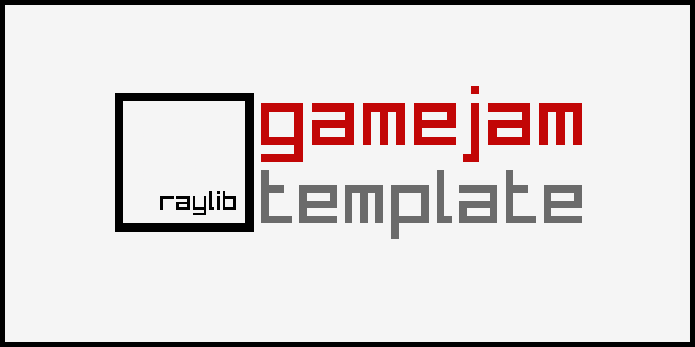

-----------------------------------
_DISCLAIMER:_

Welcome to the **raylib game template**!

This template provides a base structure to start developing a small raylib game in plain C. The repo is also pre-configured with a default `LICENSE` (zlib/libpng) and a `README.md` (this one) to be properly filled by users. Feel free to change the LICENSE as required.

All the sections defined by `$(Data to Fill)` are expected to be edited and filled properly. It's recommended to delete this disclaimer message after editing this `README.md` file.

This template has been created to be used with raylib (www.raylib.com) and it's licensed under an unmodified zlib/libpng license.

_Copyright (c) 2014-2026 Ramon Santamaria ([@raysan5](https://github.com/raysan5))_
-----------------------------------

## STANDOFF

### Description

Game for GMTK 2026 Game Jam

### TODO

- [ ] ! Grass animation
- [ ] ! Birds background animation
- [ ] !! Add music
- [ ] !! Add SFX
- [ ] !! Gunslingers animation
- [ ] !!! Finish gameplay UI
- [ ] 
- [ ] ? Change countdown to random metronome

### Controls

Keyboard:
 - $(Game Control 01)
 - $(Game Control 02)
 - $(Game Control 03)

### Screenshots

_TODO: Show your game to the world, animated GIFs recommended!._

### Developers

 - Made by mysyq
 - Music by MurMurich

### Links

 - YouTube Gameplay: $(YouTube Link)
 - itch.io Release: $(itch.io Game Page)
 - Steam Release: $(Steam Game Page)

### License

This project sources are licensed under an unmodified zlib/libpng license, which is an OSI-certified, BSD-like license that allows static linking with closed source software. Check [LICENSE](LICENSE) for further details.

$(Additional Licenses)

*Copyright (c) 2026 mysyq (mysyqdev)*
